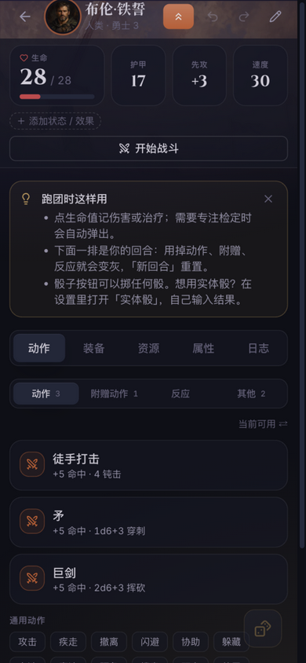
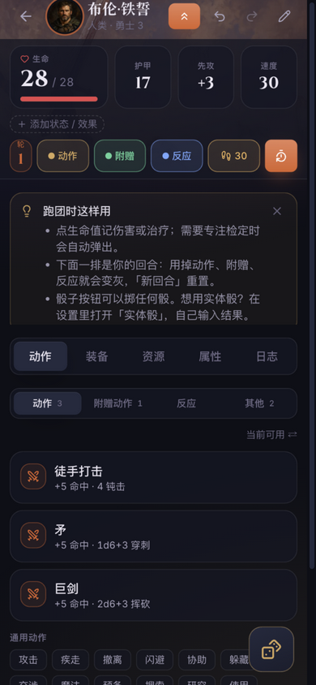
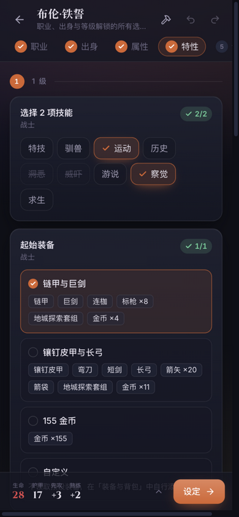

# Forge · 冒险者工坊

一个专为 **D&D 5e（2024 / SRD 5.2.1 中文）跑团**打造的离线角色助手：车卡、跑团记血、掷骰、战斗追踪，一台手机全搞定。

**不需要注册、不需要联网、数据只存在你自己的设备上。**

| 角色库 | 跑团面板 | 战斗追踪 | 骰子 | 车卡向导 |
|---|---|---|---|---|
| [](docs/screenshots/library.png) | [](docs/screenshots/play.png) | [](docs/screenshots/combat.png) | [](docs/screenshots/dice.png) | [](docs/screenshots/builder.png) |

---

## 这是什么？

跑团的时候，DM 和玩家最烦的就是翻书记血：谁中了几刀、法术位还剩几个、专注检定过了没有……Forge 就是把这件事搬到手机上：

1. **车卡（创建角色）**：跟着向导一步步选职业、出身、属性，所有该选的选项都会自动出现，算好加值，不需要你翻书。
2. **跑团（桌面游玩）**：打开角色卡就是面板——点一下记伤害、点武器就掷攻击、用掉动作会变灰、短休长休一键恢复。
3. **离线可用**：装到手机主屏幕（或装 APK）之后，没有网也能用。数据存在设备本地的 IndexedDB 里，随时可以一键备份成文件，在另一台设备上恢复。

内置 4 个现成的 3 级示例角色（战士 / 游荡者 / 牧师 / 法师），第一次打开点一个就能直接开始玩。

## 功能一览

- **车卡向导**：12 个职业、48 个子职业（PHB 包）；逐步勾选技能、专长、装备，实时预览加值和属性推导，每一步都能撤销。
- **角色卡**：生命 / 护甲 / 先攻 / 速度，状态效果（中毒、倒地……专注受伤自动弹专注检定），升级直接在卡上点。
- **跑团面板**：你的回合用掉动作 / 附赠 / 反应会变灰，「新回合」重置；战斗轮次追踪；撤销任何操作。
- **骰子**：输入任意公式（`2d6+3`、`8d6`……）、优势 / 劣势；**实体骰模式**——用真骰子掷，把点数输进去，应用照常记账。
- **法术与资源**：法术位、职业资源自动扣减和恢复；捡到药水点「自己用」就回血。
- **规则即查即用**：术语悬停提示（中英对照）、法术全文、装备词条，不用翻书。
- **中文优先**：界面、规则全文都是中文；设置里可开启双语模式（火焰箭 · Fire Bolt）。
- **PWA + APK 双形态**：可以「添加到主屏幕」当 App 用，也可以直接安装 APK。
- **备份 / 恢复**：全部数据导出一个文件；朋友发来的角色文件直接导入。
- **插件系统**：内置「创造工坊」插件，可以自己写扩展页面和自设内容（homebrew）。

## 快速开始（开发者）

要求：Node 20+ 和 [pnpm](https://pnpm.io)。

```bash
pnpm install
pnpm dev        # 启动开发服务器
```

其他常用命令：

```bash
pnpm test        # 单元测试（vitest）
pnpm typecheck   # TypeScript 检查
pnpm build       # 构建生产版本到 apps/web/dist/
pnpm e2e         # Playwright 端到端测试
```

## 打包成 Android APK

本项目是纯静态 Web 应用，用 [Capacitor](https://capacitorjs.com) 包一层原生壳即可变成 APK。已提交的 `apps/web/android/` 就是生成好的原生工程。

### 环境准备（macOS，一次性）

```bash
brew install openjdk@21 android-commandlinetools
export JAVA_HOME="$(brew --prefix openjdk@21)/libexec/openjdk.jdk/Contents/Home"
export ANDROID_HOME="$(brew --prefix)/share/android-commandlinetools"
$ANDROID_HOME/cmdline-tools/latest/bin/sdkmanager "platforms;android-36" "build-tools;36.0.0" "platform-tools"
```

### 每次打包

```bash
pnpm build                             # 先构建 web 产物
pnpm --filter @forge/web exec cap sync android   # 同步进原生工程
cd apps/web/android
./gradlew assembleDebug                # 打 APK
```

产物在 **`apps/web/android/app/build/outputs/apk/debug/app-debug.apk`**，传到手机上直接安装即可（需要在系统设置里允许安装未知来源应用）。

> 想发 release 版（更小、更快）：`./gradlew assembleRelease`。正式签名请自建 keystore，
> 在 `android/app/build.gradle` 配置签名，**不要把 keystore 提交进仓库**。

> 应用图标 / 启动屏源图在 `apps/web/assets/icon.png`（1024×1024），改完后重新生成各密度图标（`res/mipmap-*`）再打包。

## 部署成 PWA（可选）

也可以不装 APK，部署到自己的服务器后用浏览器「添加到主屏幕」。Forge 没有后端，任何静态托管都行，具体要求（HTTPS、根路径、缓存头、nginx 配置）见 [docs/deploy.md](docs/deploy.md)。

> ⚠️ 若本地生成了 PHB 2024 包（社区译本内容），构建产物**只能私有部署**，不要放到公网。

## 仓库结构

```
apps/web          # Web 应用（React 19 + Vite + Tailwind 4，PWA）
packages/core     # 规则引擎：公式、骰子、属性推导、事件溯源的游玩日志
packages/plugin-api # 插件 API
packs/srd-5.2.1   # SRD 5.2.1 中文规则包（职业/法术/物种/背景/专长/物品）
packs/phb-2024    # PHB 2024 包：本地生成（见下），生成前应用只跑 SRD
tools/art         # 美术资源处理脚本
docs/             # 部署说明、真机试玩清单、截图
```

### 关于 PHB 2024 包

SRD 5.2.1 是 Wizards of the Coast 以 CC-BY-4.0 发布的开放内容，本仓库的中文 SRD 包可以自由分发。
PHB 2024 包则基于 [DND5eChm](https://github.com/DND5eChm/DND5e_chm) 社区译本，文本版权归 WotC，
因此**译文数据只在本地生成、绝不入库**（`packs/phb-2024/src/generated/` 已被 gitignore）。
不生成它，应用就只包含 SRD 内容，一切照常工作。生成方式见 [packs/phb-2024/README.md](packs/phb-2024/README.md)。

## 数据与隐私

- 角色和设置只存在设备本地（IndexedDB），没有服务器、没有账号、没有统计。
- 换手机：设置 → 数据 → 备份全部，在新设备上恢复。

## 测试

- `pnpm test`：规则引擎、包内容金样测试、车卡推导等单元测试
- `pnpm e2e`：Playwright 跑「新车 → 战斗 → 长休」全流程和手感回归

带团前的真机检查清单见 [docs/playtest.md](docs/playtest.md)。
